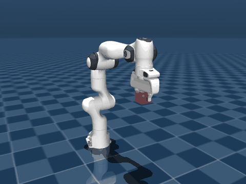

<div align="center">

# DIFFIK-PANDA

<hr>

A 6-DoF target is dragged through space, a damped least squares solver turns the
pose error into joint velocity, and the arm tracks it until the Jacobian runs
out of rank.

[](https://mujoco.readthedocs.io)
[](https://www.python.org)
[](https://numpy.org)
[](https://github.com/kevinzakka/mink)
[](LICENSE)

**[Results](#results)** · **[Tuning notes](#tuning-notes)** ·
**[Report an issue](https://github.com/luminolous/diffik-panda/issues)**

<br>



</div>

---

The target rides on a mocap body you can drag in the viewer. Every control step
the solver computes a joint velocity that drives the end-effector site toward
it, integrates that velocity into a position setpoint, and hands the setpoint to
the position actuators. Where it gets interesting is the workspace boundary: the
Jacobian loses rank as the arm straightens, and what the solver does there is
the whole subject of this repository.

## The method

The Jacobian maps joint velocity to end-effector twist:

```
xdot = J(q) qdot
```

`J` is 6x7 for the Panda arm, so the system is underdetermined. The
minimum-norm solution uses the pseudo-inverse, which blows up whenever `J`
loses rank: the arm near full extension, or two joint axes lining up. Damped
least squares replaces it with

```
qdot = J^T (J J^T + lambda^2 I)^-1 e
```

The `lambda^2 I` term keeps the 6x6 matrix invertible whatever `J` does. Away
from a singularity it is negligible and the result matches the pseudo-inverse;
near one it bounds the joint velocity at the cost of tracking accuracy.

Seven joints against a six-dimensional task leave one redundant direction: the
elbow can swing while the gripper stays put. A secondary objective is projected
onto it,

```
qdot = J^+ e + (I - J^+ J) qdot_0,   qdot_0 = Kn (q_home - q)
```

so it cannot disturb the primary task. The projector is never formed; applying
it to a vector is `v - J^T (J J^T + lambda^2 I)^-1 (J v)`, which reuses the
matrix already factored for the primary solve and keeps the same damping in
both terms.

`e` is the 6-DoF pose error. Its orientation half is the relative rotation
converted to a rotation vector, so it lives in the same space as the angular
velocity the Jacobian produces. Quaternions are never subtracted elementwise.

## Install

Python 3.11 or newer.

```
python -m venv .venv
source .venv/bin/activate        # Windows: .venv\Scripts\activate
pip install -r requirements.txt
```

The Panda model is vendored in `scene/franka_emika_panda/`; nothing is
downloaded at run time.

## Run

Interactive demo. Drag the target with `Ctrl` + right-click, rotate it with
`Ctrl` + left-click, reset with `Backspace`.

```
python scripts/run_viewer.py
python scripts/run_viewer.py --damping 1e-2 --integration-dt 0.5
python scripts/run_viewer.py --nullspace-gain 5
```

Benchmarks. Both write to `results/`, both are deterministic, and both drive
the same trajectory from `diffik/trajectory.py`.

```
python scripts/benchmark_damping.py
python scripts/benchmark_mink.py
python scripts/record_demo.py
```

Tests.

```
pytest tests/
```

`notebooks/01_jacobian_sanity.ipynb` checks the analytic Jacobian against
finite differences. `notebooks/02_results.ipynb` produces every figure below
from the committed CSVs and runs no simulation of its own.

## Results

The target travels straight out from the home pose to 0.70 m from the shoulder
and comes back, over 6 s at a 2 ms timestep. The Panda reaches about 0.85 m
when only position is constrained, but this path holds the orientation fixed as
well, and past roughly 0.70 m that pose stops being reachable at all. Sitting
on that edge is what makes the damping visible.

From `results/damping_sweep.csv`:

| damping | RMS position [m] | RMS orientation [rad] | peak \|dq\| [rad/s] | clipped steps | peak cond(J) |
| --- | --- | --- | --- | --- | --- |
| `1e-06` | 0.01452 | 0.02541 | 10.65 | 12 | 40,568 |
| `1e-05` | 0.01452 | 0.02541 | 10.17 | 12 | 40,472 |
| `1e-04` | 0.01451 | 0.02540 | 2.18 | 12 | 32,681 |
| `3e-04` | 0.01364 | 0.02409 | 1.07 | 10 | 12,979 |
| `5e-04` | 0.17580 | 0.68553 | 3.07 | 1145 | 128,652 |
| `1e-03` | 0.17572 | 0.68526 | 3.07 | 1140 | 693,352 |
| `3e-03` | 0.17538 | 0.68455 | 3.06 | 1140 | 1,572,330 |
| `5e-03` | 0.17483 | 0.68299 | 3.05 | 1140 | 1,572,210 |
| `7e-03` | 0.00887 | 0.01502 | 0.10 | 0 | 2,280 |
| `1e-02` | 0.00888 | 0.01502 | 0.08 | 0 | 580 |
| `1e-01` | 0.01202 | 0.01508 | 0.06 | 0 | 57 |

There are three regimes rather than one gradient.

Below about `3e-04` the solver is under-damped. The joint velocity spikes at the
singularity, up to 10.65 rad/s, clipping engages for a dozen steps, and the arm
recovers: the run ends at 0.0066 m of error.

Between `5e-04` and `5e-03` the run fails. The position RMS jumps by an order of
magnitude and the clip count goes from a dozen steps to over eleven hundred.
The interesting part is where the failure happens. At `1e-03` the arm looks fine
crossing the singularity, then degrades behind it, reaching its worst error of
0.433 m at t = 5.62 s and finishing there at 0.430 m. At that moment `cond(J)`
is back down around 32, so the arm is not in a singularity.

Nor is the clipping to blame, tempting as the correlation is. The ablation in
`results/article/` settles it: disabling the clipping entirely leaves the run
failing at 0.4299 m instead of 0.4302 m, and bounding the joint velocity
changes nothing either. What repairs it, at the same damping, is the nullspace
term, which takes the final error to 0.0066 m whether the clipping is on or
off. The ordering agrees. The failing run parts company with a healthy one at
step 1401, and the first clip does not happen until step 1860, 459 steps later.

The failure is posture drift. `||q - q_home||` separates the two outcomes
cleanly: every failing run in the study reaches 2.67 rad, every healthy one
stays at or below 1.40. Crossing the singularity, the redundant degree of
freedom is free to settle either side of a fold, and with no secondary
objective holding it, some damping values settle on the wrong side and cannot
get back. The clipping that follows is a symptom of the posture the arm has
already reached.

From about `7e-03` upward there is no clipping and the lowest tracking error,
until the damping grows large enough to cost accuracy on its own: `1e-01`
tracks worse than `1e-02`.

The band is a property of the run at `nullspace_gain = 0`, which is what this
sweep uses. Any gain from 0.5 up removes it here. It does not, however, make
the solver safe everywhere: at damping `1e-04` clipping persists at every gain
and the conditioning gets worse as the gain rises, and a fresh isolated failure
appears at gain 2. The low-damping velocity spike and the mid-band posture
collapse are two different failures.

Nor is `5e-04` to `5e-03` a fixed interval of damping. Repeating the sweep at
other reaches shows the collapse does not occur at all below 0.70 m, and that
it widens above it: four of seven damping values collapse at 0.70, five at
0.71, six at 0.72. What generalises is not the interval but the mechanism. Near
the edge of the orientation-constrained workspace the arm can come out of the
singularity on either side of a fold, and the damping decides which. The losing
side is the same posture every time: across 20 collapsed runs spanning three
reaches, seven damping values and three gains, the final configurations agree to
within 0.008 rad, with joint4 resting 2 mrad off its upper limit and joint2
16 mrad off its own.

`results/article/FACTS.md` carries the full 2D sweep, the reach study, and the
ablation behind these claims.

### Against mink

`mink` solves the same problem as a quadratic program with the joint and
velocity limits as hard constraints. Same trajectory, same duration, same
timestep, same 1 rad/s velocity bound: the DLS runs scale `dq` down to reach
that bound after solving, mink receives it as a constraint. From
`results/mink_comparison.csv`:

| method | RMS position [m] | RMS orientation [rad] | peak \|dq\| [rad/s] | clipped steps |
| --- | --- | --- | --- | --- |
| DLS `1e-04` | 0.01451 | 0.02540 | 1.000 | 12 |
| DLS `1e-03` | 0.17434 | 0.68326 | 1.000 | 1140 |
| DLS `1e-02` | 0.00888 | 0.01502 | 0.077 | 0 |
| mink | 0.00937 | 0.01479 | 0.055 | 0 |

mink never clips. Crossing the singularity it asks for a peak `|dq|` of 0.016
rad/s against 0.403 for DLS at `1e-04`, a factor of 25, for comparable tracking
error. Its final error, 0.00656 m, matches the best-tuned DLS run to five
decimal places.

The honest summary is not that the QP tracks better. Well-tuned damped least
squares tracks marginally better here, and part of even that gap is the posture
task mink carries and these DLS runs do not. What the QP buys is that there is
no tuning to get wrong. The damped solver reaches the same quality only once
you have found a damping above the failure band, and a run inside that band
gives no warning: it tracks normally right up to the singularity and only
afterwards reveals which side of the fold the arm came down on.

Note that mink also carries a posture task, which is the same kind of secondary
objective that removes the band on the DLS side. Its immunity here is not
attributable to the QP alone.

## Tuning notes

**`damping`** starts at `1e-4`. Raise it toward `1e-2` if the arm oscillates
near its reach limit. On this trajectory anything from `7e-3` upward is safe;
the band around `1e-3` is not.

**`integration_dt`** is a gain, not the physics timestep. It converts the solved
joint velocity into a position setpoint. Larger tracks more aggressively; reduce
toward 0.1 if the motion jitters.

**Under physics the error settles to a small constant rather than to zero.**
That residual is gravity droop, not a solver defect: the Panda ships with
position actuators that run their own PD loop, and holding the arm against
gravity requires a permanent setpoint offset. The residual error is what
produces that offset. It disappears entirely with gravity switched off, and it
scales as `1 / integration_dt`, so raising the gain shrinks it.

**`nullspace_gain`** costs nothing when the arm starts at the home posture,
because the secondary objective pulls toward the posture the arm is already in.
It earns its place by stopping drift. Drag the target on a wide loop and bring
it back: with the gain off the elbow keeps whatever configuration the wandering
left it in, some 2.8 rad from home, and with `--nullspace-gain 5` it returns to
within 0.01 rad at the same gripper pose.

The secondary objective is a proportional controller under an explicit
integration step, so it is the product `nullspace_gain * integration_dt` that
has to stay bounded, not the gain alone. The closed loop tolerates a gain of 5
at `integration_dt` 1.0 because the position actuators damp it; a pure kinematic
iteration at those values diverges.

**`max_angvel`** bounds `max(|dq|)` by scaling the whole vector, which preserves
its direction. It defaults to 0, which disables it.

## Notes on the model

The vendored `panda.xml` defines no site, so there is nothing to point
`mj_jacSite` at. `diffik/model.py` adds an end-effector site to the `hand` body
through `MjSpec` at load time, at the same offset `mjx_panda.xml` uses for its
gripper site. MJCF cannot add a child to a body that came from another file, and
the vendored model is not edited.

`scene/panda_ik.xml` pulls the Panda in with `<attach>` rather than `<include>`.
`<include>` resolves the vendored `meshdir` against the including file and
produces broken asset paths. `<attach>` keeps the parent's value on conflict, so
the scene sets the integrator explicitly to avoid silently dropping
`implicitfast`.

## Possible follow-ups

Not implemented here: repulsion from joint limits or manipulability maximisation
as alternative secondary objectives, collision avoidance, trajectory planning,
other robots, and real hardware.

## Credits

The Panda model in `scene/franka_emika_panda/` is vendored from
[mujoco_menagerie](https://github.com/google-deepmind/mujoco_menagerie) at
commit `da76818`, and is licensed under Apache-2.0. Its original `LICENSE` and
`README.md` are kept alongside it.

[mink](https://github.com/kevinzakka/mink) is used for the QP comparison.

This repository is MIT licensed; see `LICENSE`.
